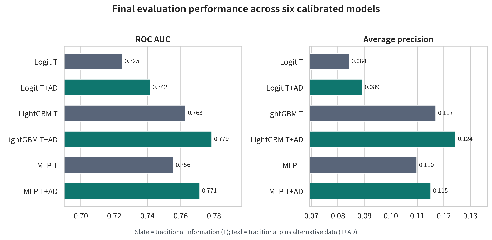
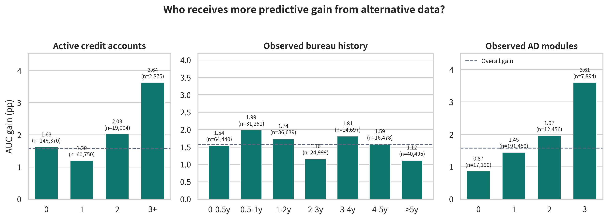
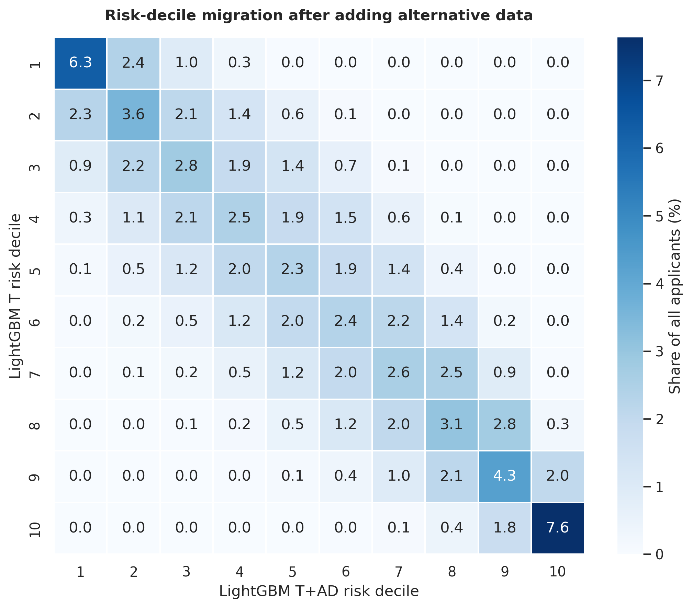
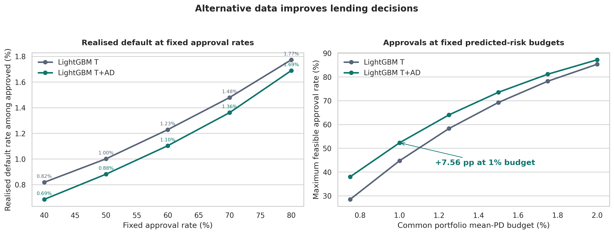
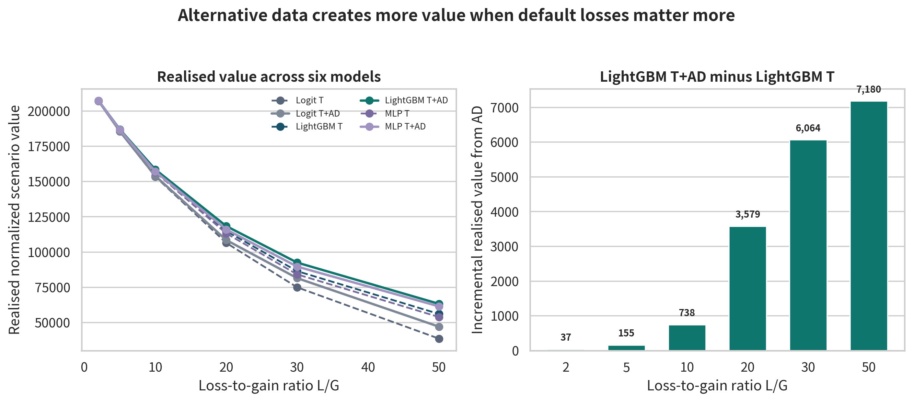

# The Unequal Value of Alternative Data in Credit Risk

**Alternative data improves credit risk prediction and lending decisions, with the strongest predictive gains among applicants who have richer observable alternative data.**

[**EXPLORE THE INTERACTIVE DASHBOARD →**](https://kerry-hao-home-credit.streamlit.app/)

## 01 · Does alternative data improve prediction?

**Yes, across three model families.** On 228,999 held-out applications, LightGBM's ROC AUC rises from **0.763 to 0.779** when alternative data is added. Its average precision rises from **0.117 to 0.124**. The same direction of improvement appears in logistic regression and a multilayer perceptron.

## 02 · Who receives the strongest predictive gains?

**Observable alternative-data coverage shapes the gain.** LightGBM's AUC improvement grows from **0.87 percentage points** for applicants with zero observed alternative-data modules to **3.61 points** for those with three. The figure also compares active credit accounts and observed bureau history.

## 03 · How does alternative data change risk rankings?

**62.7% of applications move to a different risk decile** when LightGBM incorporates alternative data. Each row shows where applicants in one traditional-data risk decile land after the additional information is included.

## 04 · What changes in approval decisions?

**At a fixed 50% approval rate,** the realised default rate among approved applicants falls from **1.00% to 0.88%**. **At a 1% portfolio mean calibrated-PD budget,** the maximum approval rate rises from **44.78% to 52.33%**: **17,303 additional approvals** on the same evaluation sample.

## 05 · What is the lender-side value?

**LightGBM with alternative data leads across all six gain/loss scenarios.** At a loss-to-gain ratio of **30**, its realised normalized scenario value rises from **86,436 to 92,500**, an increase of **6,064**. The right panel tracks the additional value across loss-to-gain ratios.

## Research design

The study uses **1,526,659 labeled Home Credit applications**, with **228,999 held out for final evaluation**. A target-stratified random split sets aside training, validation, and final evaluation samples. Model selection and probability calibration are completed before the final comparison.

Three model families—**logistic regression, LightGBM, and a multilayer perceptron**—each use two information sets. **T** contains 21 traditional application and credit-history features. **T+AD** adds 27 debit-card, deposit, and tax features plus 8 availability indicators. The main results compare the two LightGBM models on the same applicants. Alternative-data richness counts the number of modules with observed numeric content, from zero to three.

Approval simulations sort applicants by calibrated default probability. The fixed approval-rate comparison selects the same number of applicants; the fixed risk-budget comparison selects the largest group meeting a shared **portfolio mean calibrated-PD budget**. Lender-side results use a normalized gain of **1** for a non-default and loss-to-gain ratios from **2 to 50**.

**Data source:** Daniel Herman, Tomas Jelinek, Walter Reade, Maggie Demkin, and Addison Howard. Home Credit - Credit Risk Model Stability. https://www.kaggle.com/competitions/home-credit-credit-risk-model-stability, 2024. Kaggle.
